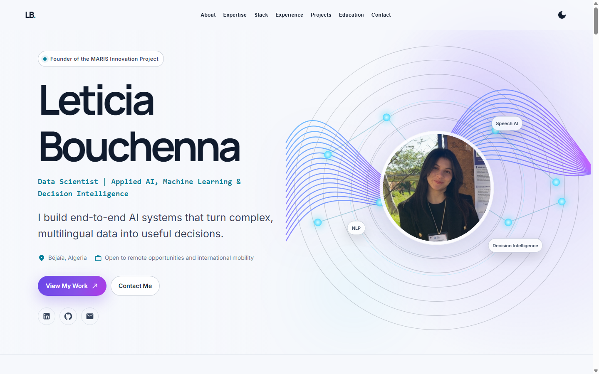

# Leticia Bouchenna — Portfolio

Professional portfolio of Leticia Bouchenna, a Data Scientist specializing in Applied AI, Machine Learning, Multilingual NLP, and Decision Intelligence.

## Live Portfolio

Visit the deployed portfolio at [leticia-bouchenna.github.io](https://leticia-bouchenna.github.io/).

## Preview



## About the Portfolio

The portfolio presents:

- Leticia's professional profile;
- Data Science and Applied AI expertise;
- featured and additional projects;
- professional experience;
- education and certifications;
- validated professional contact links.

## How It Was Built

The project was designed as a professional, responsive interface and developed with React 18 and TypeScript. Its sections are organized into reusable components, with SCSS providing the visual system and portfolio data centralized in typed data files.

The site includes responsive layouts, a light and dark theme, accessible interactions, and a static production build generated with Create React App. The development workflow includes local linting, tests, production builds, Git version control, and automated deployment through GitHub Actions and GitHub Pages.

The project was created through a workflow assisted by AI programming tools, then reviewed, tested, and versioned with Git.

## Tech Stack

- React 18
- TypeScript
- Create React App
- SCSS
- npm
- Git
- GitHub Actions
- GitHub Pages

## Project Structure

```text
Leticia-Bouchenna.github.io/
├── .github/
│   └── workflows/
│       └── deploy-pages.yml
├── docs/
│   └── images/
├── public/
├── src/
│   ├── assets/
│   ├── components/
│   ├── data/
│   └── types/
├── .gitignore
├── package.json
├── package-lock.json
├── tsconfig.json
└── README.md
```

## Running Locally

Node.js 20 and npm are recommended.

```bash
git clone https://github.com/Leticia-Bouchenna/Leticia-Bouchenna.github.io.git
cd Leticia-Bouchenna.github.io
npm ci
npm start
```

The development server is normally available at:

```text
http://localhost:3000
```

## Production Build

```bash
npm run build
```

Create React App generates the static site in:

```text
build/
```

## Continuing Development

Retrieve the latest version and start the development server:

```bash
git pull origin main
npm ci
npm start
```

After making changes:

```bash
git status
git add .
git commit -m "Describe the portfolio update"
git push origin main
```

Every push to `main` automatically triggers GitHub Actions and redeploys the portfolio.

## Deployment

The main branch is `main`, and the deployment workflow is stored in `.github/workflows/deploy-pages.yml`.

GitHub Actions:

1. installs the npm dependencies;
2. runs the production build;
3. uploads `build/` as a GitHub Pages artifact;
4. deploys the artifact to GitHub Pages.

The generated `build/` directory is intentionally excluded from Git and is recreated for every deployment.

## Quality Checks

```bash
npm ci
npx eslint src --ext .ts,.tsx
npm test -- --watchAll=false
npm run build
```

## Git Workflow

- `git pull` retrieves the latest changes from GitHub.
- `git add` prepares selected changes for the next commit.
- `git commit` creates a new local version.
- `git push` publishes the commits to GitHub and triggers deployment.

## Contact

- [LinkedIn](https://dz.linkedin.com/in/leticia-bouchenna-544a0a2a5)
- [GitHub](https://github.com/Leticia-Bouchenna)
- [Email](mailto:leticiabouchena@gmail.com)

## Acknowledgements

The initial visual foundation was adapted from the open-source [React Portfolio Template by Yuji Sato](https://github.com/yujisatojr/react-portfolio-template), distributed under the repository's MIT License.
